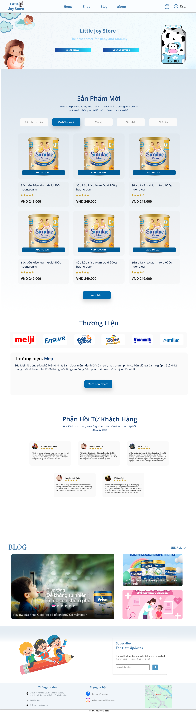
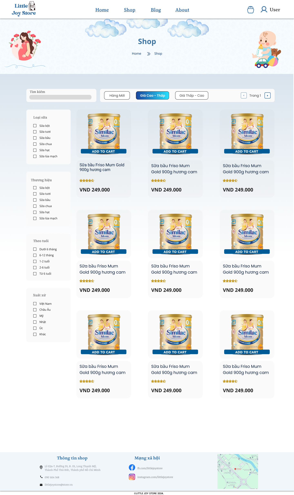
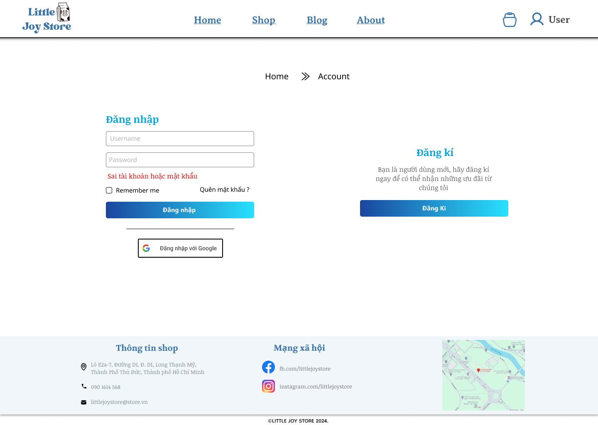
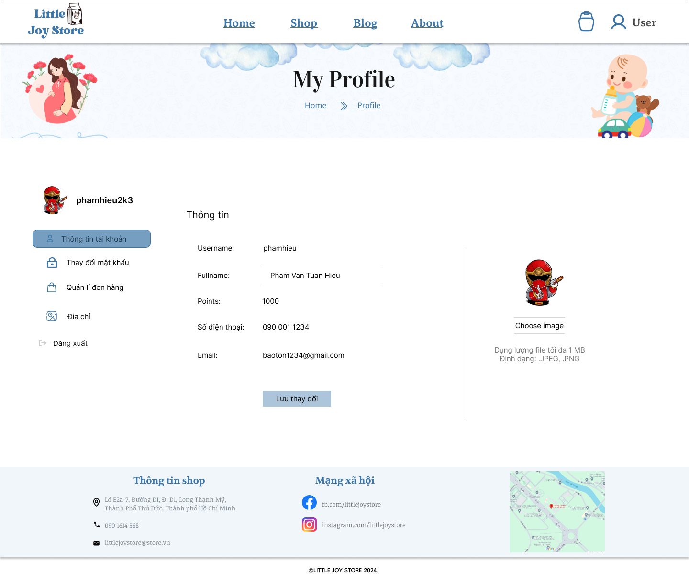

# LITTLE JOY Store - Baby And Mom Milk Store

    
    
Web Api For Milk Store

#### Introduction
The Little Joy is a team project for SWP391 course. This web is selling milk for baby and mom and they can buy it online.
Customer and administrator can use this web

#### System Design:

Technologies:
- Front-end: ReactJS, Bootstrap 5.3, FireBase
- Back-end: C# Web API, MS SQL Server, 3 Layer Architecture
- Payment: VNPay

#### Screen-shots
- HomePage

- ShopPage

- Login

- Profile

#### SPRINT SETUP

| Epic                  |                Use Case                                                     |                           
|-----------------------|-----------------------------------------------------------------------------|       
| Authenticate          | UC01 - Guest can register a user account                                    |                                
|                       | UC02 - Guest can login to their user account                                |        
|                       | UC03 - Guest can select Forget Password to retrieve access to their account |  
|                       | UC04 - Guest can login to their user account via google platform            |
|                                                                                                     |
| Product Management    | UC05 - Admin and Staff can Add product                                      |                                
|                       | UC06 - Admin and Staff can update Product                                   |        
|                       | UC07 - Admin and Staff can Delete Product                                   |  
|                       | UC08 - Admin and Staff can view Product Paginating                          |
|                       | UC09 - Admin and Staff can View Product out of stock                        |

| Name                  |                Git Account                                                  |        UseCase      |
|-----------------------|-----------------------------------------------------------------------------|---------------------|    
| Pham Van Tuan Hieu    | (https://github.com/lion3993vn)                                             | UC (2,4)            |                                    
| Lương Công Bằng       | (https://github.com/cong-bang)                                              | UC (1)              |            
| Nguyễn Kiến Minh      | (https://github.com/nguyenkienminh)                                         | UC (9)              |      
| Nguyễn Gia Bảo Anh    | (https://github.com/alicee-19)                                              | UC(3)               |    
| Võ Thị Mai Hoa        | (https://github.com/vohoa2004)                                              | UC(5,6,7)           |    

#### References:
- Figma: )
